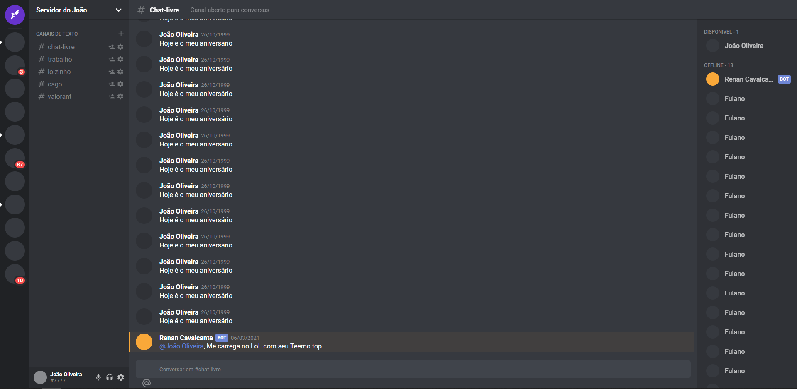
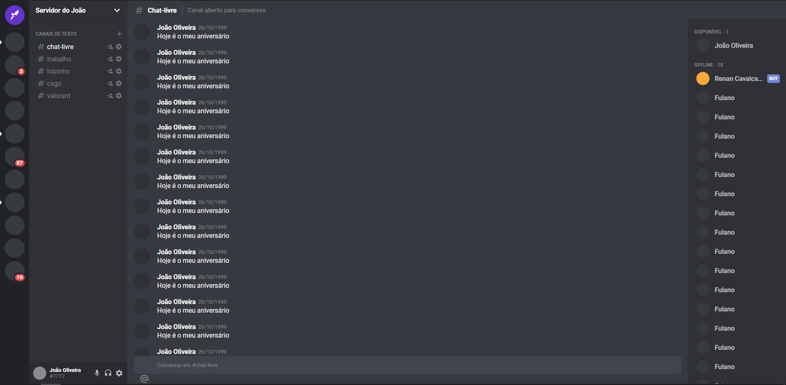

<h1 align="center">:headphones: Discord Clone :headphones:</h1>

O Clone do discord foi desenvolvimento a partir de um video explicativo da rocketseat, com o objetivo de praticar minhas habilidades em React e como complemente tive a oportunidade de conhecer o TypeScript.

## :camera: Demonstração

    
    

 

## :tv: Video Demonstrativo

---

## 🚀 Tecnologias

Este projeto foi desenvolvido com as seguintes tecnologias:

- ✔️ ReactJS

- ✔️ Styled Components

- ✔️ TypeScript

- ✔️ React Hooks

- ✔️ Grid Layout

- ✔️ Routes

## ⚙ Configuração

1- Para instalar as dependências:
> npm install

2- Para iniciar a aplicação:
> npm start

Feito com 💜 por JOÃO OLIVEIRA 👋 [Veja meu Linkedin](https://www.linkedin.com/in/joao-php/)
 

